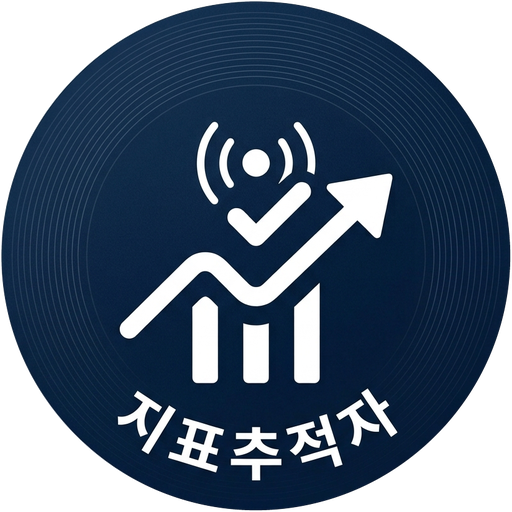
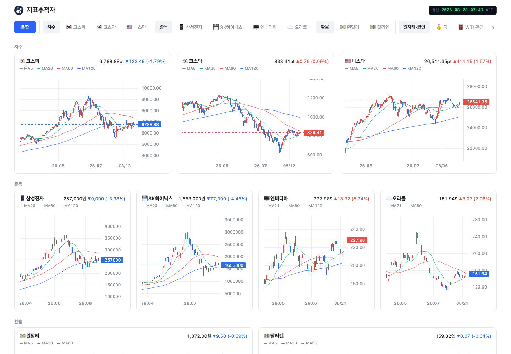
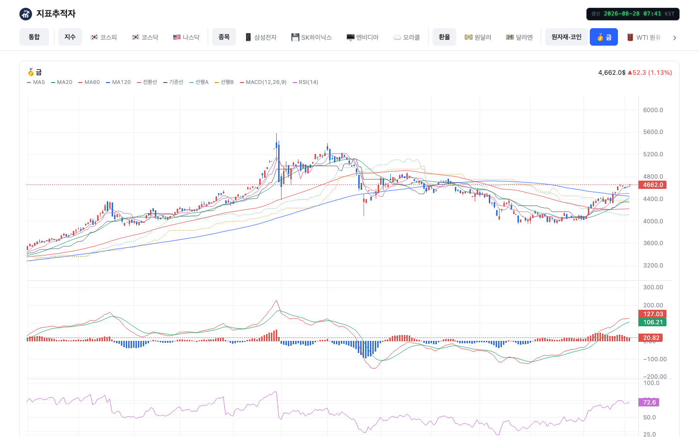
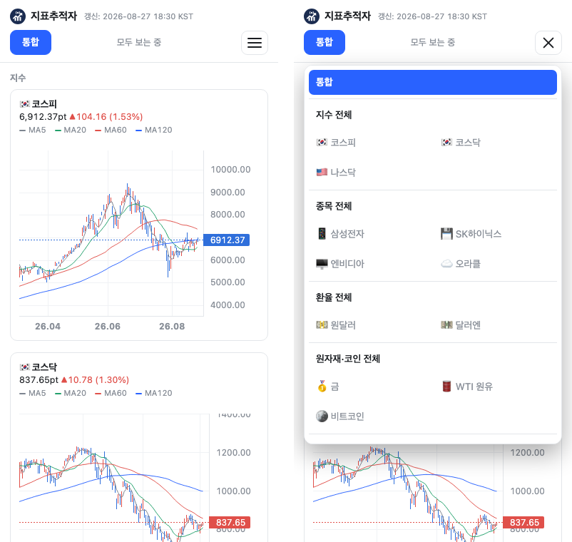

<p align="center">
  
</p>

<p align="center">
  매일 장 마감 뒤 시장 지표를 스스로 모아, 캔들차트 웹 대시보드에 그리고 텔레그램으로 보낸다.<br>
  서버는 두지 않는다 — GitHub Actions가 수집하고 GitHub Pages가 띄운다.
</p>

<p align="center">
  <b><a href="https://isaac-lee.github.io/market-indicator-tracker/">➡️ 지표추적자 열기</a></b>
</p>



<p align="center"><i>통합 뷰 — 섹터(지수·종목·환율·원자재/코인·금리·수급)마다 한 행</i></p>



<p align="center"><i>개별 지표는 크게 한 장 — 금은 이동평균·일목균형표에 MACD·RSI까지</i></p>



<p align="center"><i>휴대폰에서는 선택바가 햄버거로 접히고 차트는 한 열에 한 장씩</i></p>

---

## 어떻게 돌아가나

| | 하는 일 | 어디서 |
|---|---|---|
| **수집** | KIS·ECOS·FRED·야후에서 21개 계열을 받아 `data/*.csv`에 누적 | [`collect.py`](collect.py) |
| **대시보드** | CSV → `docs/data.json` → 캔들차트 웹페이지 | [`build_dashboard.py`](build_dashboard.py), [`docs/`](docs/) |
| **알림** | 수집·업로드를 순서대로 돌리고 결과를 텔레그램으로 | [`notify_daily.py`](notify_daily.py) |

평일 16:10 KST에 Cloudflare Worker가 [GitHub Actions](.github/workflows/daily.yml)를 깨워
셋을 차례로 돌리고 갱신된 CSV를 저장소에 다시 커밋한다. 대시보드는 그 커밋된 데이터를
그대로 읽는다 — 바깥 서비스에 기대는 데가 없다.

- **통합 뷰**: 전 지표를 섹터별로 한 화면에.
- **개별 지표**: 크게 한 장. 금·WTI·비트코인은 MACD와 RSI가 아래 칸에 붙고,
  금에는 일목균형표까지 겹친다.
- **캔들 호버**: 그 날짜의 시가·고가·저가·종가와 이동평균 값이 함께 뜬다.

## 1. 설치 / 인증

```bash
pip install -r requirements.txt
```

키는 환경변수가 우선이고, 없으면 저장소 안의 `API-KEY.txt`를 읽는다(`.gitignore` 등록됨).

```
APP Key: ...           # 한국투자증권
APP Secret: ...
ECOS Key: ...          # 한국은행 ECOS 인증키 (국고채 3년/10년 대체 경로)
```

환경변수로 넘길 경우:

```bash
export KIS_APP_KEY=... KIS_APP_SECRET=... ECOS_API_KEY=...
export KIS_ENV=prod   # 모의투자면 vps
```

접근토큰은 `~/.kis_token.json`에 캐시되며(권한 600) 만료 10분 전까지 재사용한다.
KIS는 토큰 발급을 1분에 1회로 제한하므로 캐시를 지우지 말 것.

## 2. 실행

평소에는 Cloudflare Worker가 깨우고 GitHub Actions가 돌린다(7·8절). 손으로 돌릴 일이 있을 때만 쓴다.

```bash
python notify_daily.py        # 수집 + 텔레그램 브리핑까지 한 번에 (Actions가 부르는 것)
python build_dashboard.py     # data/*.csv -> docs/data.json (대시보드 갱신)
```

```bash
python collect.py --init      # 과거치 전체 수집 + market_data.xlsx 생성 (최초 1회)
python collect.py --daily     # 최근 10영업일 갱신 (매일)
python collect.py --backfill 1825   # 전 계열 5년치 다시 받아 CSV에 합침 (5절)
python collect.py --excel     # data/*.csv -> market_data.xlsx 재생성
python import_ecos.py "시장금리(일별)_04000531.xlsx"   # ECOS 엑셀 -> data/ktb3y.csv
python test_collect.py        # 네트워크 없이 로직 검증
```

```bash
python collect.py --snapshot              # 오늘 기준 CLAUDE.md 형식 스냅샷 표
python collect.py --snapshot 2026-08-21   # 특정 날짜
```

대시보드를 로컬에서 보려면 `docs/`를 그냥 띄우면 된다(빌드 도구 없음).

```bash
python build_dashboard.py && python -m http.server 8420 --directory docs
```

`--daily`/`--init`은 마지막 줄에 요약을 찍는다: `21계열 갱신 · stale 0`.
계열의 마지막 데이터가 5일(달력) 넘게 낡으면 `stale`로 이름이 올라간다.
휴장은 임계 안에 들어오므로 조용하고, 소스가 깨지면 드러난다.
**전 계열이 낡았을 때만 종료 코드가 non-zero다** — 계열 하나 때문에 매일
실패로 표시하면 실패 표시 자체가 무뎌진다.

수집 결과는 `data/<지표>.csv`에 날짜 기준으로 누적된다(같은 날짜는 최신값으로 덮어씀).
종목·지수 코드는 전부 `codes/instruments.json`에 있다. 코드가 바뀌면 그 파일만 고치면 된다.

## 3. 수집 지표 / 사용 API

기간·주기는 [`collect.py`](collect.py)의 `SPEC` 한 곳에서 정한다. 수집 범위와 출력 가공(기간 자르기 +
주간 리샘플)이 모두 이 값을 따르므로 범위를 바꾸려면 `SPEC`만 고치면 된다.

계열 이름은 `data/<계열>.csv` 와 `docs/data.json` 의 키로 그대로 쓰인다.
**굵게** 표시한 것이 웹 대시보드에 그려지는 계열이다.

| 계열 | 지표 | 출처 (TR ID) | 주기 | 기간 |
|---|---|---|---|---|
| **`kospi`** | 코스피 OHLC | 국내주식업종기간별시세 `FHKUP03500100` | 일 | 6개월 |
| **`kosdaq`** | 코스닥 OHLC | 동일 (`1001`) | 일 | 6개월 |
| **`samsung_elec`** | 삼성전자 OHLC | 국내주식기간별시세 `FHKST03010100` | 일 | 6개월 |
| **`sk_hynix`** | SK하이닉스 OHLC | 동일 (`000660`) | 일 | 6개월 |
| **`wti`** | WTI 원유 선물 OHLC | 해외선물 `HHDFC55020100`, 실패 시 **야후 `CL=F`** | 일 | 6개월 |
| **`usdkrw`** | 원달러(원/달러 KMB) | 해외 기간별시세 `FHKST03030100` (X/`FX@KRW`) | 일 | 1년 |
| **`usdjpy`** | 달러엔(엔/달러) | 동일 (X/`FX@JPY`) | 일 | 1년 |
| **`ust10y`** | 미국채 10년 금리 | **FRED `DGS10`** (KIS 미지원) | 일 | 3년 |
| **`ktb3y`** | 국고채 3년 금리 | **한국은행 ECOS** `817Y002`/`010200000` | 주(금) | 3년 |
| **`investor_flow`** | 주체별 순매수(외국인/기관/개인/연기금/투신) | 시장별 투자자매매동향(일별) `FHPTJ04040000` | 주(금) | 2년 |
| `sp500` | S&P 500 OHLC | 야후 `^GSPC` | 일 | 6개월 |
| **`nasdaq`** | 나스닥 OHLC | 야후 `^IXIC` | 일 | 6개월 |
| `dow` | 다우 OHLC | 야후 `^DJI` | 일 | 6개월 |
| `russell2000` | 러셀 2000 OHLC | 야후 `^RUT` | 일 | 6개월 |
| `dxy` | 달러지수 OHLC | 야후 `DX-Y.NYB` | 일 | 6개월 |
| **`btc`** | 비트코인 OHLC | 야후 `BTC-USD` | 일 | 6개월 |
| **`gold`** | 금 선물 OHLC | 야후 `GC=F` | 일 | 6개월 |
| `ust2y` | 미국채 2년 금리 | FRED `DGS2` | 일 | 3년 |
| `ktb10y` | 국고채 10년 금리 | ECOS `817Y002`/`010210000` | 주(금) | 3년 |
| **`oracle`** | 오라클 OHLC | 야후 `ORCL` | 일 | 6개월 |
| **`nvidia`** | 엔비디아 OHLC | 야후 `NVDA` | 일 | 6개월 |

위 표의 **기간은 `SPEC` 값**(엑셀로 내보낼 때 자르는 범위)이다. 웹 대시보드가 보여주는
구간은 이와 별개로 `docs/app.js`의 `view`가 정한다(예: 금·비트코인 1년, WTI 6개월).
CSV에는 그보다 긴 데이터가 쌓여 있어야 이동평균이 화면 왼쪽에서 잘리지 않는다 — 5절 참고.

CSV에는 수집한 원본(일별)을 그대로 쌓고, 기간 자르기·주간 집계는 출력 시점(`for_output`)에 한다.
범위를 다시 늘려도 이미 받아둔 데이터는 버려지지 않는다.

- 주간 집계: 순매수는 **주간 합계**, 가격·금리는 **주 마지막 값**(W-FRI).
- 누적/이동평균은 저장하지 않고 출력 시 계산: `foreign_cum`, `foreign_ma4w`(주간 4행 이동평균),
  `foreign_cum_ma4w`, 각 주체별 `*_cum`. 순매수 단위는 **백만원**(`*_ntby_tr_pbmn`).

### 실계좌 프로브로 확인된 사항 (2026-08-04)

- **환율** `FX@KRW`(원/달러 KMB), `FX@JPY`(엔/달러) 정상 조회.
- **미국채 10년** — KIS에는 시계열이 없다. `FHKST03030100`에 `.TNX`, `TNX`, `^TNX`, `.IRX`,
  `.FVX`, `.TYX`, `BY0202`(해외 마스터의 "미국 10년 T-NOTE 수익률")를 시장코드 `I/N/S/X` 조합으로
  전부 시도했지만 오류 없이 빈 응답(`output2` 0건)만 온다 → **FRED `DGS10`**로 대체.
  키가 필요 없고 주간(금요일) 리샘플까지 로컬에서 처리한다.
  ECOS에도 `902Y023 주요국제금리`가 있지만 **월간**이라 주간 요구에 못 미친다.
- **국고채 3년** — KIS 장내채권 API(`FHKBJ773404C0`)는 채권 *가격*만 주고 금리를 주지 않는다.
  ECOS(`817Y002` / `010200000`)가 맞는 소스이고, 인증키로 3년치(729영업일, 2023-08-07~)를 자동
  수집한다. 값은 ECOS 다운로드 파일과 일치 확인(2024-07-23 = 3.084, 2026-08-03 = 3.742).
  키 없이 시작할 때만 `import_ecos.py`로 엑셀/CSV를 적재하면 된다.
- **WTI** — 종목코드(`CLU26` 등)는 유효하지만 시세 호출이 `EGW00551 NYMEX SUB거래소 신청 계좌가
  아닙니다`로 막힌다. 이 경우 **야후 `CL=F`(근월물 연결선물) 일봉으로 자동 대체**한다(키 불필요,
  2년 502행 OHLC 확인). KIS HTS/MTS에서 해외선물 NYMEX 시세를 신청하면 자동으로 KIS 경로를 탄다.
  근월물 코드는 `CL + 월코드 + 연도2자리`로 자동 계산하며, 고정하려면
  `codes/instruments.json`의 `futures.wti.srs_cd`에 직접 넣는다.

  WTI 소스 비교(2026-08-03 기준 실측):

  | 소스 | OHLC | 과거 | 키 | 값 |
  |---|---|---|---|---|
  | KIS 해외선물 | O | 2년+ | KIS + NYMEX 시세 신청 | 신청 전 조회 불가 |
  | **야후 `CL=F`** (현재 사용) | **O** | 2년(504행) | 불필요 | 종가 79.51 |
  | OilPriceAPI 무료 | X (현물가만) | 1년(354행, `past_year`) | 발급됨 | 79.73 |
  | FRED `DCOILWTICO` | X (종가만) | 무제한 | 불필요 | 약 1주 지연 |

  OilPriceAPI는 `past_day/week/month/year`만 있고 임의 구간(`by_period`)은 100건에서 잘리며
  시가·고가·저가가 없어 캔들 차트에는 못 쓴다. 최신가 확인용으로는 충분하다.
- **호출 제한** — 시세 API는 초당 3건 근처에서 `EGW00201`이 난다. 클라이언트가 요청 간격 0.35초 +
  재시도 3회로 처리한다.
- **업종(지수) 시세** 응답은 약 50건에서 잘려서 60일씩 끊어 호출한다(주식·환율은 100일).

### 투자자 필드 매핑(INVESTOR_MAP) 수정법

위치: [`collect.py`](collect.py)의 `INVESTOR_MAP` 딕셔너리(`fetch_investor` 바로 위).
`"출력 컬럼명": ["KIS 응답 필드 후보", ...]` 형태이고, 앞에서부터 값이 있는 첫 필드를 쓴다.

```python
INVESTOR_MAP = {
    "date": ["stck_bsop_date"],
    "foreign": ["frgn_ntby_tr_pbmn"],        # 외국인
    "institution": ["orgn_ntby_tr_pbmn"],    # 기관계
    "individual": ["prsn_ntby_tr_pbmn"],     # 개인
    "pension": ["fund_ntby_tr_pbmn"],        # 연기금등
    "trust": ["ivtr_ntby_tr_pbmn"],          # 투신
    "close": ["bstp_nmix_prpr"],
}
```

주체를 더 넣고 싶으면 한 줄 추가하면 된다. 실제 응답에 있는 필드(확인됨):

| 접두어 | 주체 | 접두어 | 주체 |
|---|---|---|---|
| `frgn_` | 외국인 | `bank_` | 은행 |
| `frgn_reg_` / `frgn_nreg_` | 등록/미등록 외국인 | `insu_` | 보험 |
| `prsn_` | 개인 | `mrbn_` | 종금·저축은행 |
| `orgn_` | 기관계 | `fund_` | 연기금등 |
| `scrt_` | 증권 | `etc_orgt_` | 기타법인·단체 |
| `ivtr_` | 투신 | `etc_corp_` | 기타법인 |
| `pe_fund_` | 사모펀드 | `etc_` | 기타계 |

접미어는 금액이 `_ntby_tr_pbmn`(백만원), 수량이 `_ntby_qty`(주). 예외적으로 사모펀드 수량은
`pe_fund_ntby_vol`, 기타법인 수량은 `etc_corp_ntby_vol`이다. 수량 기준으로 보고 싶으면
`"foreign": ["frgn_ntby_qty"]`처럼 바꾸면 된다.

필드명이 안 맞으면 실행 중 `[주의] 투자자 필드 미매핑: [...] / 응답필드: [...]`가 한 번 출력된다.

## 4. 자동 실행

**평일 16:10(KST)에 Cloudflare Worker 가 GitHub Actions 를 깨운다**
(`trigger/`, `.github/workflows/daily.yml`). 수집·커밋·텔레그램·Pages 배포는
전부 Actions 안에서 돌고, Worker 는 시각이 되면 실행을 요청하는 일만 한다.

GitHub 자체 `schedule` 은 쓰지 않는다. 이 저장소에서 예정 슬롯 여섯 번이
연속으로 발화하지 않았고, 같은 워크플로가 `workflow_dispatch` 로는 매번
정상 실행됐다. 경위는 `docs/superpowers/specs/2026-09-01-cloudflare-cron-trigger-design.md`
에 적어 두었다.

`data/`가 저장소에 커밋되므로 실행할 때마다 Actions 가 결과를 다시 커밋해
푸시한다 — 이게 유일한 실행 지점이면 된다.

로컬/VPS 에서 손으로 또는 cron 으로 병행 실행하면 `data/` 사본이 갈려 서로
덮어쓴다. 자동 실행은 Worker → Actions 한 경로로 두고, 다른 환경은 필요할 때만
손으로 돌린다.

## 5. 웹 대시보드 (GitHub Pages)

```bash
python build_dashboard.py    # data/*.csv -> docs/data.json
```

`docs/index.html`이 `docs/data.json`을 읽어 [Lightweight Charts](https://tradingview.github.io/lightweight-charts/)로
그린다. 빌드 도구도 프레임워크도 없다 — `docs/`를 GitHub Pages로 게시하면
(설정 → Pages → 브랜치/`docs` 폴더) 별도 서버 없이 정적으로 뜬다.

| 파일 | 하는 일 |
|---|---|
| `docs/index.html` | 뼈대. 헤더 + 선택바 + 차트 자리 |
| `docs/app.js` | 차트 정의(`SECTORS`)와 그리기·선택바 전부 |
| `docs/indicators.js` | 이동평균·MACD·RSI·일목균형표 계산 |
| `docs/style.css` | 다크/라이트 두 벌 색과 반응형 |
| `docs/data.json` | `build_dashboard.py`가 만든 데이터 (커밋됨) |
| `docs/icon.svg` | 파비콘 겸 헤더 로고 (같은 모티프를 선으로 단순화한 것) |
| `docs/logo.png` | 이 문서 맨 위의 로고 |
| `docs/screenshots/` | 이 문서에 붙는 화면 사진. 화면이 바뀌면 다시 찍는다 |

**보는 방법**

- **통합**에서 전부 한 화면에 놓거나, 섹터 버튼으로 그 섹터만, 지표 버튼으로 하나만 본다.
  고른 것은 URL 해시에 남아 새로고침해도 유지된다.
- 통합 뷰는 섹터마다 한 행을 쓰고 그 안의 차트가 폭을 똑같이 나눈다 — 개수가 2개든
  4개든 행의 총 폭은 같다. 섹터 순서는 `docs/app.js`의 `SECTORS`가 정한다.
- 금리를 뺀 나머지는 캔들. 캔들에 마우스를 올리면 그 날짜의 시가·고가·저가·종가와
  이동평균 값이 뜬다.
- 차트의 확대·이동은 꺼 두었다. 페이지를 스크롤하다 커서가 차트를 지나면 휠이
  확대로 먹혀서 보던 구간이 멋대로 바뀌기 때문이다. 구간은 `view`로만 정한다.

**선택바** (`>1200px` / `≤1200px` 두 벌)

- 넓은 화면: 한 줄에 전부 늘어놓고 좌우로 민다. **통합만 왼쪽에 고정**되고, 그 방향에
  더 있으면 `‹` `›`와 음영이 뜬다(화살표는 눌러서 미는 버튼이기도 하다). 끝에 닿으면
  그쪽 화살표만 사라진다 — 계속 떠 있으면 더 있는 줄 알고 헛되이 민다.
- 좁은 화면: 오른쪽 **햄버거**로 접고, 왼쪽에 통합 버튼, 가운데에 "무엇을 보는 중"인지
  적어 둔다. 23개를 어떻게 늘어놓아도 화면 위쪽을 통째로 먹거나 옆으로 숨기 때문이다.
- 차트 카드는 폭에 따라 한 행에 4장 → 2장 → 1장으로 접힌다(1100px, 760px).
  휴대폰에서는 한 열에 한 장씩 — 두 장만 나란히 놓아도 캔들이 읽히지 않는다.

**햄버거 메뉴 높이** — 열 때 `visualViewport`로 "메뉴 위끝부터 지금 보이는 화면 아래끝까지"를
재서 `max-height`에 넣는다(`sizePanel`). iOS는 `vh`를 주소창·제어바가 **없을 때** 기준으로
잡아서, `70vh`로 두면 제어바가 올라와 있을 때 메뉴 아래쪽이 그 밑에 깔려 스크롤을 끝까지
내려도 손가락이 닿지 않는다. 제어바는 스크롤 중 접혔다 펴지므로 열려 있는 동안 계속 다시
잰다. CSS 쪽은 `dvh` 폴백을 두고, 아래 여백에 `env(safe-area-inset-bottom)`을 더해 마지막
줄이 홈 인디케이터에 걸치지 않게 한다.

**헤더** — 제목 줄 오른쪽 끝에 갱신 시각을 계기판처럼 놓는다. 어두운 칩 안에 고정폭
숫자를 초록으로 옅게 발광시키고 라벨(`갱신`·`KST`)은 흐리게 눌러 숫자만 도드라지게 했다.
칩 색은 두 테마에서 같다 — 계기판은 주변이 밝든 어둡든 제 색으로 켜져 있다.

**이 문서의 사진 찍는 법** — 로컬 서버를 띄우고 헤드리스 크롬으로 `docs/screenshots/`에
덮어쓴다.

```bash
python -m http.server 8420 --directory docs &
CHROME="/Applications/Google Chrome.app/Contents/MacOS/Google Chrome"
"$CHROME" --headless --disable-gpu --hide-scrollbars --virtual-time-budget=7000 \
  --screenshot=docs/screenshots/desktop-overview.png --window-size=1440,1000 http://localhost:8420/
```

휴대폰 화면은 `--window-size=390`으로 찍히지 않는다 — macOS 크롬은 창 최소 폭이 있어
레이아웃이 그 폭으로 잡히지 않고 잘린 그림이 나온다. 폭 390px짜리 `<iframe>`을 담은
임시 페이지를 만들어 그 안에서 렌더한 뒤 찍는다.

**차트 구성 바꾸기** — `docs/app.js`의 `SECTORS` 한 곳만 고치면 된다.

| 키 | 뜻 |
|---|---|
| `type` | `candle`(OHLC) / `line`(종가만) / `flow`(누적 순매수) |
| `ma` | 이동평균 기간들. 색은 기간별로 고정돼 차트가 달라도 같은 기간이면 같은 색 |
| `extras` | `ichimoku`(겹쳐 그림) / `macd` / `rsi`(아래 칸으로 붙음) |
| `view` | 처음 보여줄 봉 수 |
| `icon` | 카드·버튼 앞 이모지. 텔레그램 브리핑과 같은 것을 쓴다 |

기업 로고는 상표라 이미지 파일을 따로 받아 넣어야 해서 이모지로 대신했다.
그리는 계열은 텔레그램 브리핑(`notify_daily.py`의 `BRIEFING_GROUPS`)과 같다 —
`data/`에는 S&P·다우·러셀·달러지수도 쌓이지만 차트로는 그리지 않는다.

`build_dashboard.py`는 기간을 자르지 않은 전체 데이터를 넘긴다
(`output_frames(trim=False)`). 이동평균·일목균형표가 앞쪽 데이터를 먹기 때문에,
`SPEC` 기간만 넘기면 화면 왼쪽에서 MA120 같은 선이 잘려 나온다.

화면에 보이는 구간(`view`)보다 **이동평균 기간만큼 앞의 데이터가 더 쌓여 있어야**
선이 왼쪽에서 잘리지 않는다. MA120을 6개월 구간에 그리려면 대략 2년치가 필요하다.
모자라면 한 번만 더 받아두면 된다(CSV는 합쳐지므로 반복 실행해도 안전하다):

```bash
python collect.py --backfill 1825    # 전 계열 5년치 다시 받아 CSV에 합침
python build_dashboard.py
```

야후 계열은 엔드포인트가 2년까지만 주므로 `--backfill`을 더 크게 잡아도 2년에서
멈춘다. MA120에는 충분하다.

데이터를 갱신하려면 `build_dashboard.py`를 다시 돌리고 `docs/data.json`을 커밋한다
(GitHub Actions가 매일 자동으로 한다).

## 6. 텔레그램 일일 브리핑

```bash
python notify_daily.py
```

`collect.py --daily` 를 돌리고 그 결과를 텔레그램 메시지로 보낸다. 수집이 실패하면
무엇이 어떻게 실패했는지를 대신 보낸다.

```
📊 2026-08-28 시장 브리핑

▶ *지수*
🇰🇷 KOSPI 6,912.37 (+104.16, +1.53%) 🟢
...
▶ *👥 수급(외국인/기관/개인)*
+133,282 / +183,528 / -1,911,575 (백만원)

🔗 자세히보기(웹 페이지)
https://buly.kr/2JqqPBg
```

문구는 `BRIEFING_GROUPS`가 정한다. 이모지는 대시보드 카드와 같은 것을 쓰고, 소수 자릿수는
계열마다 따로 준다 — 원화 종목에 소수점 두 자리는 아무 뜻도 없으면서 여섯 글자를 잡아먹고,
줄이 폰 화면 폭을 넘으면 뒤의 🟢/🔴만 다음 줄로 떨어져 읽기 사나워진다.

봇 토큰/채팅 ID는 환경변수 `TELEGRAM_BOT_TOKEN`/`TELEGRAM_CHAT_ID` 또는
`API-KEY.txt`의 `Telegram Bot Token:` / `Telegram Chat ID:` 줄에서 읽는다.

환경변수 두 개로 동작을 줄일 수 있다(Actions가 이걸로 빌드 테스트와 실제 수집을 가른다).

| 변수 | `1`이면 |
|---|---|
| `SKIP_KIS` | KIS 계열을 건너뛴다. KIS는 토큰을 새로 받을 때마다 계정으로 알림톡을 보내는데, 러너는 매번 새 환경이라 실행 한 번이 알림 한 통이 된다. WTI는 야후로 대체 |
| `DRY_RUN` | 텔레그램으로 보내지 않고 화면에만 찍는다 |

`HEALTHCHECK_URL`은 `notify_daily.py`가 아니라 워크플로의 마지막 단계가 쓴다 —
7절 참고.

## 7. GitHub Actions (실행 담당)

`.github/workflows/daily.yml`이 `notify_daily.py` → `build_dashboard.py`를
실행하고 `data/`, `docs/`를 커밋·푸시한다. 언제 도는지는 Actions 가 정하지
않는다 — `trigger/` 의 Worker 가 정한다.

두 가지 계기로 도는데 하는 일이 다르다.

| 계기 | KIS 수집 | 텔레그램 | 결과 커밋 |
|---|---|---|---|
| `workflow_dispatch` | 입력값 `skip_kis`에 따라 (Worker 는 전체 수집으로 부른다) | O | O |
| `push` (코드 올릴 때) | X | X (`DRY_RUN`) | X |

`push`는 문서만 바뀌었으면 아예 돌지 않는다(`paths-ignore`: `**.md`,
`docs/screenshots/**`, `docs/logo.png`, `.gitignore`). 실행에 영향을 주지 않는 변경이라서다.

`push`는 빌드가 깨지지 않았는지만 보는 것이라 바깥 상태를 하나도 건드리지 않는다.
수동 실행이 KIS를 기본으로 건너뛰는 것도 같은 이유 — 손으로 여러 번 돌려보는 동안
알림톡이 그 횟수만큼 오기 때문이다. Worker 가 부르는 `workflow_dispatch`만 전체 수집이고,
이게 하루 한 번뿐이라 알림톡도 하루 한 통이 정상 비용이다.

설정(최초 1회):

1. **Settings → Secrets and variables → Actions → New repository secret**로 추가:
   - `KIS_APP_KEY`, `KIS_APP_SECRET` — 한국투자증권
   - `ECOS_API_KEY` — 한국은행 ECOS
   - `TELEGRAM_BOT_TOKEN`, `TELEGRAM_CHAT_ID`
   - `HEALTHCHECK_URL` — healthchecks.io ping 주소. 없어도 실행은 그대로
     되지만, 실행이 조용히 멈췄을 때 알아챌 방법이 없어진다.
2. **Settings → Pages → Build and deployment → Source**를 `Deploy from a branch`,
   브랜치는 `main` / 폴더는 `/docs`로 지정. 몇 분 뒤
   `https://<계정>.github.io/<저장소>/`에서 대시보드가 뜬다.
3. 워크플로 탭에서 **Run workflow**로 최초 1회 수동 실행해 정상 동작을 확인한다.

Actions 실행 중 실패하면(토큰 만료, API 장애 등) `notify_daily.py`가 실패 사유를
텔레그램으로 보낸다. `data`/`docs` 커밋은 push 권한이 필요하므로 워크플로 상단의
`permissions: contents: write`를 지우지 말 것.

빌드·커밋 단계는 `if: always()`로 둔다. `collect.py`는 계열을 받는 족족 CSV에 쓰므로,
텔레그램 전송이 실패했다고 커밋을 건너뛰면 **그날 받아둔 데이터가
통째로 버려진다** — 다음 날 `--daily`는 최근 며칠만 보기 때문에 구멍이 남는다.
푸시는 rebase로 세 번까지 다시 시도한다. 올리는 것이 데이터 파일뿐이라, 사이에 사람이
push 했다고 실행이 실패할 이유가 없다.

마지막 단계는 `HEALTHCHECK_URL`로 healthchecks.io ping 을 보낸다. 이 단계를
맨 뒤에 두는 이유: 성공 ping 은 "그날 데이터가 실제로 커밋·배포됐다"를
뜻해야지, 수집만 끝났다는 뜻이면 안 된다. `job.status`로 성공/실패를 가르고,
`HEALTHCHECK_URL`이 비어 있으면 조용히 건너뛴다.

## 8. 트리거 (Cloudflare Worker)

언제 도는지를 정하는 것은 `trigger/` 의 Worker 다. 평일 16:10 KST 에 깨어나
`daily.yml` 을 dispatch 한다. 배포와 토큰 발급 절차는 `trigger/README.md` 에
있다.

실행이 멈추면 healthchecks.io 가 알린다 — `daily.yml`의 마지막 단계가 매
실행 끝에 ping 을 보내고, 평일 16:20 KST 까지 ping 이 없으면 알림이 온다.
Worker 가 죽든, 토큰이 만료되든, Actions 가 멈추든 침묵 자체가 신호가 된다.
